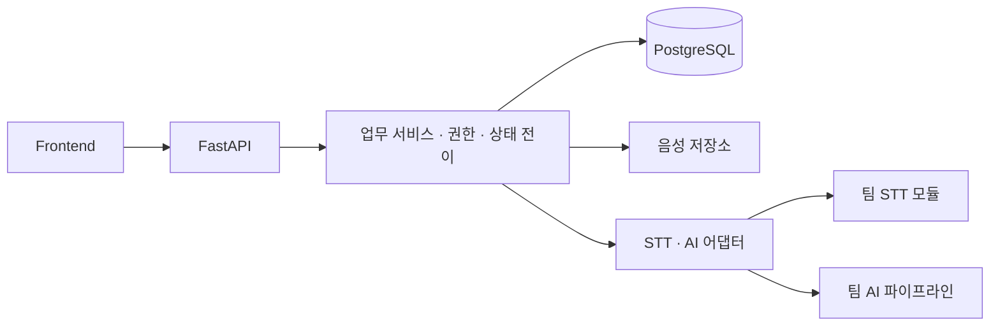

# I-SPOT — AI 상담 기록 서비스

**상태:** 개발 중 · **역할:** Backend 개발 및 팀 산출물 통합 · **기록 기준:** 2026-09-04

[팀 저장소](https://github.com/jeongin721/I-SPOT) · [Backend 구현](https://github.com/jeongin721/I-SPOT/tree/6d326cfee34e1ef2b00f0012e532f4cab52151a7/backend) · [통합 PR #6](https://github.com/jeongin721/I-SPOT/pull/6)

## 프로젝트 목적

아동 상담 음성을 전사하고 상담 기록 초안을 생성해 상담사의 기록·검수 업무를 지원하는 서비스입니다. AI 결과를 상담사가 확인하고 수정·승인하는 흐름을 유지합니다.

핵심 흐름은 사례 선택 → 상담 회차 생성 → 음성 업로드 → 전사 → 원문 검수·확정 → AI 요약 → 수정·승인 → 저장입니다.

## 담당 범위

Backend 담당으로 다음 기능을 구현했습니다.

- FastAPI와 PostgreSQL 기반 Case/Session API 및 데이터 모델
- 로그인과 상담사별 사례 접근 권한
- 음성 업로드와 입력 검증
- 전사 수정·확정, 버전 관리와 분석에 사용된 버전 추적
- AI 결과 저장·조회, 상담 요약 수정·승인
- 문서 생성·조회·수정·승인 API와 Audit Log
- STT·AI 어댑터, Mock Provider, 테스트, API 문서, 데모 데이터

STT 엔진·AI 요약 및 모델링은 담당 팀원의 산출물입니다. Backend에서는 공통 입출력 규격에 맞춰 호출·검증·저장하는 경로를 다루며, 팀 코드를 모으는 통합 PR을 작성했습니다. 2026-09-04 기준 PR #6은 검토 대기 상태입니다.

## 기술과 구조

Python, FastAPI, PostgreSQL, SQLAlchemy 2.x, Alembic, Pydantic, pytest, Docker, GitHub Actions를 사용합니다.

Frontend는 Backend API를 통해 작업을 요청합니다. Backend는 Case/Session을 기준으로 데이터를 관리하며, 외부 결과를 검증한 뒤 상담사가 검수할 수 있는 상태로 저장합니다.

## 사례 1. 상담사의 수정·승인과 데이터 일관성

### 문제

AI 생성 결과와 상담사의 수정본, 승인된 기록을 구분해야 합니다. 원문을 확정하기 전에 분석을 요청하거나 재분석 결과가 상담사의 수정 내용을 덮어쓰는 흐름을 제어할 필요가 있었습니다.

### 구현

- Session의 허용된 상태 전이를 정의하고 API 요청 시 검사합니다.
- 전사 수정 시 새 버전을 생성하고 AI 결과에 입력 전사 버전을 저장합니다.
- 상담사가 수정한 요약은 재분석 시 보존합니다.
- 승인된 요약의 수정과 중복 승인을 차단하고 수정·승인 작업을 기록합니다.

### 검증

원문 확정 전 분석 거부, 분석 버전 추적, 상담사 수정본 보존, 승인 후 수정 차단을 테스트합니다.

[상태 전이 코드](https://github.com/jeongin721/I-SPOT/blob/24f366c6efd1aea4b471f0b9030fb720249b11b9/backend/app/core/state_machine.py) · [요약 검수 테스트](https://github.com/jeongin721/I-SPOT/blob/24f366c6efd1aea4b471f0b9030fb720249b11b9/backend/tests/test_summary_review.py) · [분석 버전 추적 테스트](https://github.com/jeongin721/I-SPOT/blob/24f366c6efd1aea4b471f0b9030fb720249b11b9/backend/tests/test_analysis.py#L185)

## 사례 2. 외부 STT·AI와 분리한 API 개발과 검증

### 문제

팀별 모듈의 개발 일정과 외부 API의 응답·비용·실패 여부에 관계없이 Backend의 핵심 흐름을 검증할 수 있어야 했습니다.

### 구현

- STT·AI 호출을 어댑터로 분리하고 Mock Provider를 제공합니다.
- Pydantic으로 전사와 AI 출력 규격을 검증합니다.
- 처리 요청은 202와 상태를 반환하고, 후속 조회로 진행 상황을 확인합니다.
- Provider 실패·시간 초과·잘못된 출력에 대해 오류 코드와 상태를 남기는 경로를 구현했습니다.

### 검증과 한계

외부 API 키 없이 업로드 → 전사 → 원문 검수 → AI → 요약 승인 흐름을 테스트합니다. 오류 응답과 실패 후 재시도도 확인합니다.

현재 MVP는 BackgroundTasks와 Polling을 사용합니다. 별도 작업 큐의 내구성이나 프로세스 재시작 후 자동 복구를 보장하는 구조는 아니며, 실제 Provider 모듈의 오류 전달은 통합 단계에서 추가 검증하고 있습니다.

[STT 어댑터](https://github.com/jeongin721/I-SPOT/blob/24f366c6efd1aea4b471f0b9030fb720249b11b9/backend/app/adapters/stt_adapter.py) · [AI 어댑터](https://github.com/jeongin721/I-SPOT/blob/24f366c6efd1aea4b471f0b9030fb720249b11b9/backend/app/adapters/ai_adapter.py) · [실패·재시도 테스트](https://github.com/jeongin721/I-SPOT/blob/24f366c6efd1aea4b471f0b9030fb720249b11b9/backend/tests/test_stt_transcript.py#L190)

## 검증 현황

2026-09-04, Python 3.12.14 환경에서 통합 커밋 `24f366c6efd1aea4b471f0b9030fb720249b11b9`를 기준으로 확인한 결과입니다.

- Backend pytest: 130개 통과
- 팀 STT·AI `tests/`: 32개 통과
- Backend ruff: 통과
- 해당 커밋의 [GitHub Actions](https://github.com/jeongin721/I-SPOT/actions/runs/33827773719): 성공

테스트 개수는 검증 범위를 설명하기 위한 수치입니다. 실제 외부 STT·LLM 호출, 모델 품질, 전체 배포 환경의 검증은 별도로 진행해야 합니다. 팀 테스트를 포함한 집계이며 개인 단독 작성 건수는 아닙니다.

재실행 방법과 환경 변수는 [Backend README](https://github.com/jeongin721/I-SPOT/blob/24f366c6efd1aea4b471f0b9030fb720249b11b9/backend/README.md), 프론트엔드 연동 규격은 [API Contract](https://github.com/jeongin721/I-SPOT/blob/24f366c6efd1aea4b471f0b9030fb720249b11b9/backend/docs/API_CONTRACT.md)를 참고할 수 있습니다.

## 진행 중인 통합 과제

- 실제 STT 모듈의 실패 전달, Provider 설정과 화자 정보 보존 검증
- 브라우저 녹음 형식과 STT 입력 형식 일치
- STT·AI 코드를 포함한 통합 Docker와 CI 구성
- 최신 AI 출력 규격과 Backend·Frontend 간 호환성 합의
- 프론트엔드에서 로그인부터 검수·승인까지 전체 흐름 확인

위 항목은 점검 후 정리한 후속 작업이며, 해결 완료 성과로 집계하지 않습니다. 상세 경과는 [개발 기록](../logs/2026-09-04-ispot-integration-review.md)에 남깁니다.

## 개발 도구 활용

개발과 문서화 과정에서 AI 코딩 도구를 활용했습니다. 이 문서와 2026-09-04 산출물 점검도 AI 도구의 도움을 받아 정리했습니다. 기여 근거는 연결된 코드·PR·테스트로 확인할 수 있도록 구성했습니다.

[포트폴리오 홈으로](../README.md)
